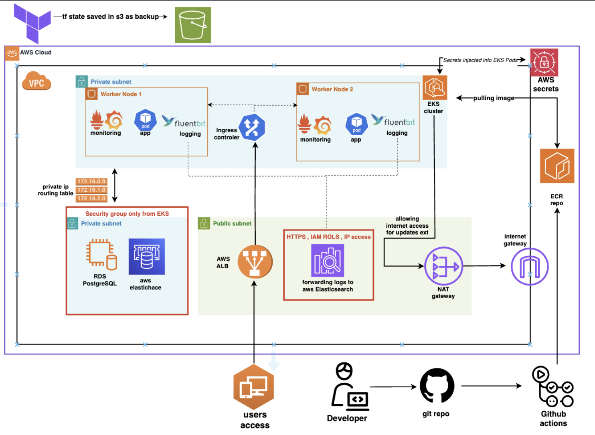

# StatusPage Project 🚀


Production-grade **StatusPage Application** deployed on **AWS**, orchestrated with **Terraform**, **EKS**, and **GitHub Actions CI/CD pipeline**.  
This project is built as part of a professional DevOps portfolio showcasing end-to-end cloud native architecture within a **$300/month AWS budget**.

> ✅ Enterprise architecture  
> ✅ Cost-effective ARM instances  
> ✅ Infrastructure as Code (IaC)  
> ✅ Fully automated CI/CD  
> ✅ Centralized logging & monitoring  
> ✅ Application tracing  
> ✅ Security-first approach  

---

## 🌐 Project Overview

The StatusPage application enables real-time incident management and status updates for critical services. It is fully containerized and runs in AWS EKS with managed services for PostgreSQL, Redis, and observability tooling.

<p align="center">
  
</p>

---

## ✨ Features

- 🧩 Modular Infrastructure (Terraform)
- 🛠️ Multi-stage Docker builds (ARM64 / t4g instances)
- 🔒 Secrets Management via AWS Secrets Manager
- 🔄 CI/CD with GitHub Actions + SAST/SCA/security scanning
- ☸️ EKS Cluster with ALB Ingress Controller
- 🗄️ PostgreSQL (RDS) + Redis (ElastiCache)
- 📈 Monitoring with Prometheus & Grafana
- 🪵 Centralized Logging via Fluent Bit → Elasticsearch + Kibana
- 🔍 Application Tracing with Grafana Tempo
- 💸 Cost-optimized architecture (~$200-300/month dev environment)

---

## 🧩 Tech Stack

| Category              | Tooling                                                                 |
|----------------------|--------------------------------------------------------------------------|
| Cloud Infrastructure  | AWS (VPC, EKS, RDS, ElastiCache, Secrets Manager, ACM, IAM)             |
| IaC                   | Terraform                                                              |
| Containerization      | Docker (multi-stage builds, ARM64 base)                                |
| Orchestration         | Kubernetes (EKS), Helm, kubectl                                        |
| CI/CD                 | GitHub Actions, SAST, SCA, secret scanning                             |
| Database              | PostgreSQL (RDS)                                                       |
| Caching               | Redis (ElastiCache)                                                    |
| Monitoring            | Prometheus, Grafana, Grafana Tempo                                     |
| Logging               | Fluent Bit, Elasticsearch, Kibana                                      |
| Security              | AWS IAM, IRSA, ACM (SSL), GitHub Advanced Security                     |

---

## 📊 Estimated AWS Costs (Dev Environment)

> _Approximate and variable — well below $300/month target._

| Service                | Estimate (Monthly) |
|------------------------|-------------------|
| EKS (t4g.medium x2)    | ~$60              |
| RDS PostgreSQL (t4g.small) | ~$30–40       |
| ElastiCache Redis (t4g.small) | ~$20–30    |
| NAT Gateway            | ~$30              |
| Load Balancer (ALB)    | ~$18–25           |
| CloudWatch / Logs      | ~$5–10            |
| ACM Certificates       | Free              |
| S3 (Terraform backend) | <$1               |
| Elasticsearch (EC2 t4g.small) | ~$15–20    |
| **Total**              | **~$180–220**     |

---

## 🚀 CI/CD Pipeline Overview

1. **Test**
   - Run Django tests in CI with PostgreSQL service

2. **Code Analysis & Security**
   - ✅ SAST: CodeQL
   - ✅ SCA: Dependency review
   - ✅ Secrets scanning: GitHub Advanced Security

3. **Docker Build**
   - Multi-stage, ARM64 Docker builds
   - Push to Amazon ECR

4. **Deploy**
   - Update EKS deployment using `kubectl set image`

5. **Email Notification**

---

## ⚙️ Infrastructure Components

| Module                  | Description                                 |
|-------------------------|---------------------------------------------|
| `vpc`                   | Custom VPC with public/private subnets and NAT Gateway |
| `eks`                   | Managed Kubernetes cluster (EKS) with ALB ingress |
| `rds-postgres`          | PostgreSQL 15.x (t4g instance)             |
| `redis`                 | ElastiCache Redis (t4g instance)           |
| `secrets-manager`       | Application secrets management             |
| `acm`                   | SSL/TLS certificates for HTTPS             |
| `iam`                   | Fine-grained IAM roles and policies        |
| `monitoring`            | Prometheus, Grafana, Grafana Tempo         |
| `logging`               | Fluent Bit shipping logs to Elasticsearch/Kibana |

---

## 🧩 Project Structure

. ├── terraform/ # Infrastructure as Code (modularized) │ ├── modules/ │ └── environments/ ├── .github/workflows/ # GitHub Actions CI/CD pipelines ├── statuspage_app/ # Django application source code ├── helm/ # Helm chart for Kubernetes deployment ├── prometheus/ # Prometheus custom values.yaml ├── docs/ # Documentation & architecture diagrams ├── Dockerfile # Multi-stage ARM64 Docker build ├── requirements.txt # Python dependencies (psycopg2-binary) ├── README.md # Project documentation └── LICENSE # Project license

---

## 🧩 Deployment Guide

### Prerequisites

- AWS Account
- AWS CLI configured
- Terraform v1.5+
- kubectl
- Helm
- Docker
- GitHub repository with secrets configured

### Setup Infrastructure

```bash
cd terraform/environments/dev
terraform init
terraform apply
```

### Build & Push Docker Image

```bash
docker buildx build --platform linux/arm64 -t <your-ecr-repo>:latest .
docker push <your-ecr-repo>:latest
```

### Deploy to Kubernetes
```bash
cd helm
helm upgrade --install statuspage ./statuspage --namespace statuspage --create-namespace
```

### Access Application
Visit: https://app.imlinfo.xyz

---

## 🔑 Required GitHub Secrets

To run CI/CD workflows and deploy successfully, add the following secrets to your GitHub repository:

| Secret Name                      | Description |
|----------------------------------|-------------|
| `AWS_ACCESS_KEY_ID`              | AWS access key for Terraform and ECR push |
| `AWS_SECRET_ACCESS_KEY`          | AWS secret access key |
| `AWS_REGION`                     | AWS region (e.g., `us-east-1`) |
| `ECR_REGISTRY`                   | AWS ECR registry URL (e.g., `992382545251.dkr.ecr.us-east-1.amazonaws.com`) |
| `ECR_REPOSITORY`                 | ECR repository name (e.g., `statuspageitai-ecr`) |
| `KUBECONFIG_BASE64`              | Base64 encoded kubeconfig for the EKS cluster |
| `EMAIL_ADDRESS`                  | User email address |
| `EMAIL_PASSWORD`                 | Secret key for GitHub |

> 💡 **Tip:**  
> For `KUBECONFIG_BASE64`, you can generate it using:
> ```bash
> cat ~/.kube/config | base64
> ```

Additionally, if you want to use GitHub Advanced Security (recommended for secret scanning, SAST):
- Make sure GitHub Advanced Security is enabled for your repository.

---

🗺️ Future Improvements
 - Add Horizontal Pod Autoscaler (HPA)

 - Setup CloudFront + WAF

 - Auto-Rotation of Secrets

 - Load testing pipeline (e.g., k6)

 - Implement Canary or Blue/Green deployments

 - Terraform Cloud or Atlantis for automated IaC

 ---

🤝 Contribution
- Contributions, issues, and feature requests are welcome!

- Fork this repo

- Create your feature branch (git checkout -b feature/feature-name)

- Commit your changes (git commit -m 'feat: add feature')

- Push to the branch (git push origin feature/feature-name)

- Open a pull request
